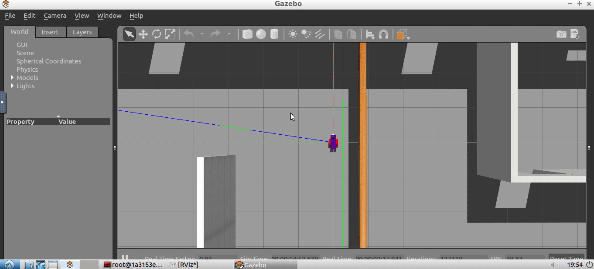

# nd209-map-my-world
This is a ROS project, part of the Udacity Robotics Nanodegree program. This was developed under ROS Kinetic.
This project uses the RTAB-Map SLAM module to map and localize, besides the Gazebo simulator and the teleop twist keyboard to simulate the world and navigate it respectively.

# Build
Go to your catkin workspace:
```
cd /path/to/catkin_ws
```
Clone the repository and run
```
git submodule init
git submodule update
catkin_make
```

# Run
After building, launch Gazebo and Rviz:
```
roslaunch my_robot world.launch
```
Launch the mapping node, to start the RTAB-Map SLAM processing module:
```
roslaunch my_robot mapping.launch
```
Then launch the teleop twist keyboard script to navigate.
```
rosrun teleop_twist_keyboard teleop_twist_keyboard.py
```


